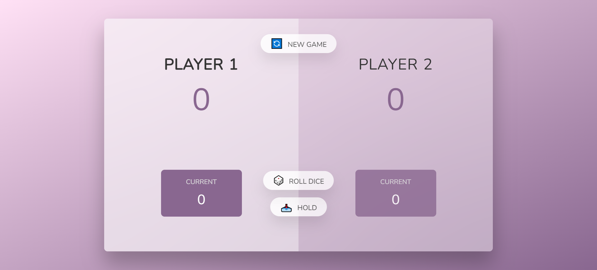

## Dice-Game    
This is a game of two players. 

## Rules
You can roll your dice and hold to your points. 
If it rolls to 1 and you did not hold your points, then your turn is up and will not recieve any points.
Whoever reaches 50 oints first is the winner!
You can play how many times you want by clicking the NEW GAME button which resets your scores.

## Built With

  * HTML
  * CSS
  * JavaScript
  
## Demo
[Click Here to see demo](https://benevolent-pegasus-200258.netlify.app//) 
    
## Acknowledgments

  * The Complete JavaScript Course 2021: From Zero to Expert! by Jonas Schmedtmann
